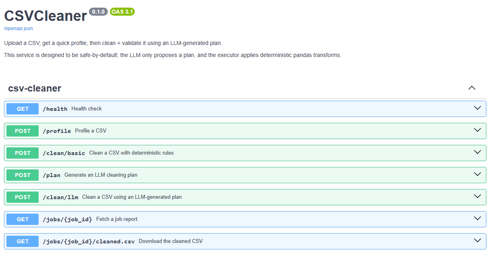

# CSVCleaner (Agentic CSV Cleaning API)

CSVCleaner is a small FastAPI service that profiles a CSV and can clean it end-to-end using an LLM-generated cleaning plan.

The main idea is an agentic workflow that stays reproducible:

- the LLM proposes a structured cleaning plan (JSON)
- the plan is validated (schema + semantic checks)
- execution is deterministic via pandas transforms
- artifacts are saved (cleaned csv, plan json, report json)

This tool does not directly modify your data or run arbitrary code.

---

## API Docs

Swagger UI screenshot:



---

## Endpoints

Explore everything interactively at /docs.

- GET `/health`
  Basic health check.

- POST `/profile`
  Upload a CSV and get a dataset profile (shape, missingness, preview rows).

- POST `/plan`
  Upload a CSV and get an LLM cleaning plan (validated and saved).

- POST `/clean/basic`
  Deterministic cleaning only (no LLM).

- POST `/clean/llm`
  Full pipeline: profile -> plan -> validate -> execute -> save artifacts.

- GET `/jobs/{job_id}`
  Read the saved report JSON for a prior run.

- GET `/jobs/{job_id}/cleaned.csv`
  Download the cleaned CSV artifact for a prior run.

---

## Example Outputs

Example outputs are committed so you can review the project without running it:

- `reports/examples/profile_example.json`
- `reports/examples/plan_example.json`
- `reports/examples/report_example.json`

These were generated using the included sample dataset:

- `data/raw/messy_IMDB_dataset.csv`

---

## Quickstart

### 1) Setup

Create and activate a virtual environment, then install dependencies.

Windows (PowerShell):

- `python -m venv .venv`
- `.venv\\Scripts\\Activate.ps1`
- `pip install -r requirements.txt`

Mac/Linux:

- `python -m venv .venv`
- `source .venv/bin/activate`
- `pip install -r requirements.txt`

### 2) Configure environment variables

This project only needs one env var: `OPENAI_API_KEY`

Create a local .env file in the repo root (not tracked by git):

`OPENAI_API_KEY=your_key_here`

### 3) Run the API locally

From the repo root:

- `uvicorn src.api.app:app --reload`

Then open:

- http://127.0.0.1:8000/docs

### 4) Run the demo script (curl)

Mac/Linux/GitBash:

- `chmod +x scripts/demo_local.sh`
- `./scripts/demo_local.sh`

The script calls `/health`, `/profile`, `/plan`, and `/clean/llm` using the sample CSV and saves results to `reports/examples/`.

---

## Project Structure

```
csv-cleaner/
  data/
    raw/
      messy_IMDB_dataset.csv
    processed/               (not tracked)
  reports/
    figures/
      docs_example.png
    examples/
      report_example.json
      plan_example.json
      profile_example.json
  outputs/                   (not tracked)
    cleaned/
    reports/
    plans/
  src/
    api/
      app.py                 (FastAPI app + router wiring)
      routes.py              (endpoints)
    llm/
      client.py              (OpenAI wrapper)
      prompts.py             (prompt templates)
      schemas.py             (cleaning plan schema)
    pipeline/
      profile.py             (dataset profiling)
      planner.py             (LLM -> plan)
      executor.py            (apply plan)
      validate.py            (semantic plan validation)
      artifacts.py           (write artifacts)
    tools/
      transforms.py          (cleaning transforms)
  tests/
    conftest.py
    test_api_health.py
    test_clean_and_jobs.py
    test_llm_prompts_and_schema.py
  scripts/
    demo_local.sh
  .github/workflows/ci.yml
  .env.example
  .gitignore
  README.md
  requirements.txt
```

---

## How the Pipeline Works

`/profile`

1. Read uploaded csv into pandas
2. Compute missingness and preview rows
3. Return a profile object

`/plan`

1. Build a prompt using the profile
2. Call OpenAI for a structured JSON plan
3. Validate plan semantics (422 if invalid)
4. Save plan to `outputs/plans/{job_id}.json`

`/clean/llm`

1. Generate a plan (same as `/plan`)
2. Validate plan semantics
3. Execute deterministic transforms in executor.py
4. Generate before/after profiles
5. Save artifacts:
   - `outputs/cleaned/{job_id}.csv`
   - `outputs/plans/{job_id}.json`
   - `outputs/reports/{job_id}.json`
6. Return job_id, plan, report, and artifact paths

---

## Testing

Run unit and API smoke tests: `pytest -q`

CI runs via GitHub Actions in `.github/workflows/ci.yml`.
